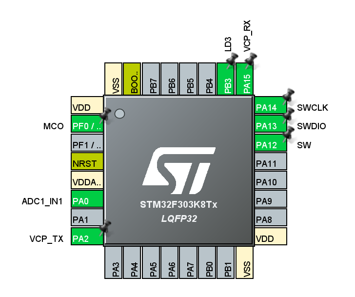

# 演習4 ADC

今回はピンからの入力電圧を連続値(アナログ)で受け取るためのペリフェラル，Analog Digital Converter:ADCを用いて，Nucleoで取得したセンサの値をPCのターミナル上で表示する．

## ハードウェア初期化画面での設定

### ADCの設定

今回仕様する基板ではA0ピン，つまりPA0ピンに温度センサが接続されている．
左のタブから

[Analog]>[ADC1]を選択し，[IN1]を[IN1 Single-ended]

と選択することで有効化することができる．


また，設定で[Continuous Conversion]を[Enable]にすること(忘れると一度値を取ったまま，次ADC_Startが実行されるまで動かない)


最終的なピン割り当てはこの通り




## コーディング

ADCの値の取得はGPIOのようにワンラインではできない．
```HAL_ADCEx_Calibration_Start```でキャリブレーション，```HAL_ADC_Start```でADCのスタートを行い，
```HAL_ADC_PollForConversion```で変換終了を確認してから```HAL_ADC_GetValue```で値を受け取らなければ，適切な値を受け取れない．

次のコードはHALハンドルが```hadc1```のADCチャンネルで値を取得し，UartでPCに送信するサンプルコードである．

```c
	/* Infinite loop */
	/* USER CODE BEGIN WHILE */
	HAL_ADCEx_Calibration_Start(&hadc1, ADC_SINGLE_ENDED);
	HAL_ADC_Start(&hadc1);
	uint32_t adc1_val = 0;
	uint8_t  buf[10] = {};
	while (1) {
		adc1_val = HAL_ADC_GetValue(&hadc1);
		sprintf(buf , "%d\n\r" , adc1_val);
		HAL_UART_Transmit( &huart2 , buf , sizeof(buf) , 0xffff);
		HAL_Delay(1000);
		/* USER CODE END WHILE */

		/* USER CODE BEGIN 3 */
	}
	HAL_ADC_Stop(&hadc1);
    /* USER CODE END 3 */
```

演習4の解説は以上です．

###  課題4

PA5に接続された照度センサも同様に有効化し，温度・照度センサの値を1秒ごとにターミナルに表示してください．

[実装例はこちら](./main.c)
