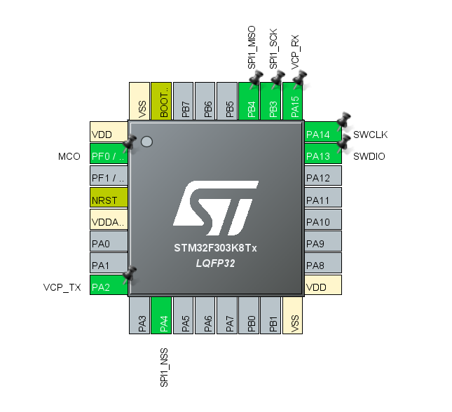
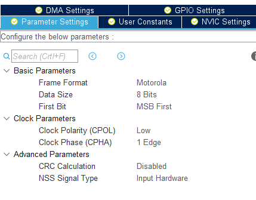
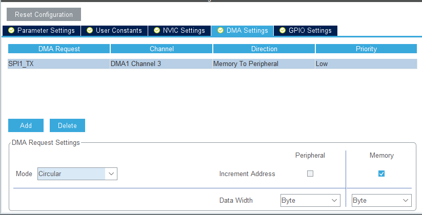
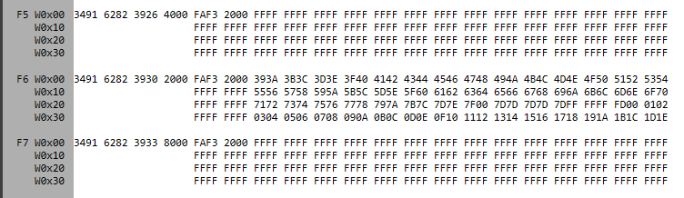

# 演習7 最小構成のPI機器設計

この演習では，最小構成のPI機器の実装を行う．

テレメータインターフェイスの受信プロトコル（資料は公開出来ないため各自参照）はSPI通信プロトコルに似ており，実際にSPI通信プロトコルでの通信を確認している．

今回はそのSPI通信を実装する．

## ハードウェア設定

[Connectivity] > [SPI1]でSPI設定画面を開き，タブで[SPI Transmit Only Slave]を，下の[Hardware NSS Input Signal]を選択し，SPI通信を有効化する．
（LD3ピンが残っている場合は競合して選択できないので，先に解除する．）




ピンを有効化した後，次のように設定する．



DMAも設定する



## コーディング部

SPI通信を使ってとりあえず動かしてみる．
次をコピー&ペーストして書き込み．

```c
/* Private user code ---------------------------------------------------------*/
/* USER CODE BEGIN 0 */
#define FrameSize 128
uint8_t buf[FrameSize] = {};

void HAL_SPI_TxCpltCallback(SPI_HandleTypeDef *hspi) {
	HAL_SPI_Abort_IT(hspi);
	HAL_SPI_Transmit_DMA(&hspi1, buf, FrameSize);
}
/* USER CODE END 0 */

/**
  * @brief  The application entry point.
  * @retval int
  */
int main(void)
{
  /* USER CODE BEGIN 1 */
  /* USER CODE END 1 */

  /* MCU Configuration--------------------------------------------------------*/

  /* Reset of all peripherals, Initializes the Flash interface and the Systick. */
  HAL_Init();
  /* USER CODE BEGIN Init */
  /* USER CODE END Init */
  /* Configure the system clock */
  SystemClock_Config();

  /* USER CODE BEGIN SysInit */
  /* USER CODE END SysInit */
  /* Initialize all configured peripherals */
  MX_GPIO_Init();
  MX_DMA_Init();
  MX_USART2_UART_Init();
  MX_SPI1_Init();
  /* USER CODE BEGIN 2 */
	for (int i = 0; i < FrameSize; i++) {
		buf[i] = i % 256;
	}
	HAL_SPI_Transmit_DMA(&hspi1, buf, FrameSize);
  /* USER CODE END 2 */

  /* Infinite loop */
  /* USER CODE BEGIN WHILE */
	while (1) {
    /* USER CODE END WHILE */

    /* USER CODE BEGIN 3 */
	}
  /* USER CODE END 3 */
}

```

1. 電源及び模擬テレメータとの接続
2. TLMSV.exeを起動
3. [PresetFile]を[PreTelemeter_Test.csv]に設定
4. [Dev.Open]クリック後，[Start]をクリック



このような画面が出ていればOK